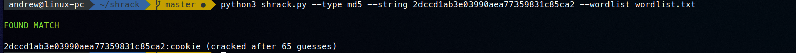

# SHRACK
*🚀 Fast hash dictionary attack*

Shrack is a very fast python coded hash cracker. It can crack: md5 and sha256 types by giving a list. I hope, with the help of the community, we will make this project better

**Requirements**: python3

# Example Usage
```bash
$ python3 shrack.py --type md5 --string 2dccd1ab3e03990aea77359831c85ca2 --wordlist wordlist.txt
```
Using the `type` argument we provide the hash type, it can be at the moment md5 or sha256

Using the `string` argument we provide the hash that we need to crack

Using the `wordlist` argument we provide the wordlist we will use to dictionary attack the hash that was provided in the `string` argument


